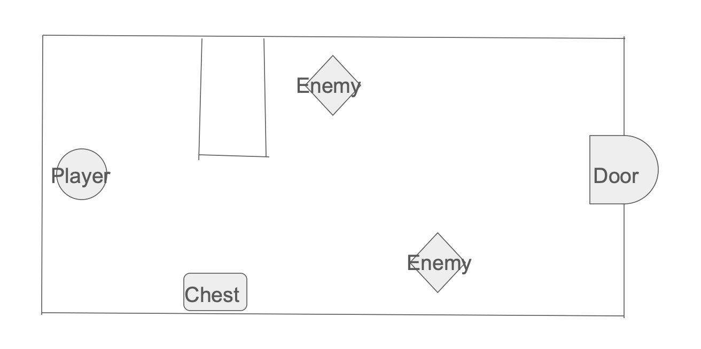
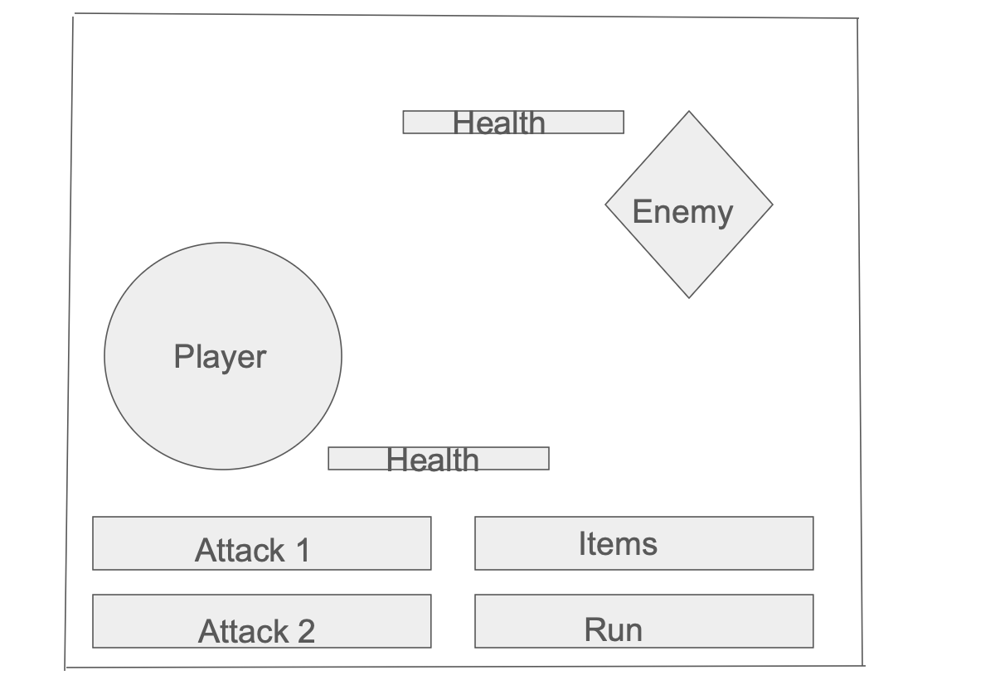

# Project Proposal — *Cipher of the Deep*

## Elevator Pitch
Do you enjoy 2D games? Do you like RPGs? **Cipher of the Deep** is a 2D top-down RPG/dungeon crawler where you can play as a Knight, Mage, or Rogue. You’ll fight monsters, explore a sprawling dungeon, and conquer challenging bosses. As you navigate, you’ll find powerful gear and level up to face the final boss, **“The Dark Mage.”** The game is designed to challenge your combat knowledge, navigation, and strategy.

## Game Synopsis
The player begins by choosing one of three classes: **Knight**, **Mage**, or **Rogue**. This decision shapes much of the player’s experience for the run. The player then loads into a dungeon to explore and encounter enemies, loot, and doors. Progressing through doors reveals new areas. After enough progression, the player will find a boss. Defeating a boss unlocks a large new area—effectively a new level. To prepare for bosses, players defeat monsters and loot chests to acquire better gear and gain levels. The run concludes with the final boss, **“The Dark Mage,”** which will be extremely challenging.

## Objectives
The main objective of **Cipher of the Deep** is to defeat the final boss, **“The Dark Mage.”**

## Mechanics
- **Movement:** WASD for top-down exploration.
- **Combat:** Turn-based encounters triggered on enemy interaction. Players choose among several attacks or defensive options.
- **Progression:** Gain levels and gear by defeating enemies and finding loot throughout the dungeon.

## Mock-Ups
**Dungeon layout**

**Fight screen**

